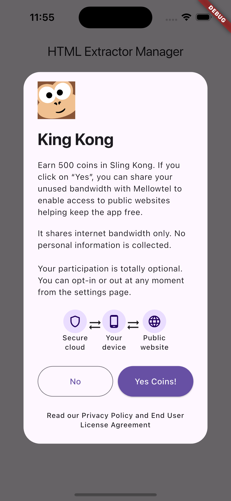

# Mellowtel

`Mellowtel` is an open-source, consensual, transparent monetization engine for Flutter Apps.

## Usage

With Mellowtel's Open-Source library, your users can share a fraction of their unused internet by using a transparent opt-in/out mechanism. Trusted partners — from startups to 501(c)(3) non profits — access the internet through the network and you get a share of the revenue (1000 users —> around $50 MRR)

## Installation

Add `mellowtel` to your pubspec:

```yaml
flutter pub add mellowtel
```

When running on macos, please [configure the macOS App Sandbox](https://inappwebview.dev/docs/intro#setup-macos) by providing network permissions.

## Usage

### 1. Initialize `Mellowtel`

Start by creating an instance of `Mellowtel` with your unique configuration key and details for the user consent popup. 

```dart
import 'package:mellowtel/mellowtel.dart';

final Mellowtel mellowtel = Mellowtel(
    "123", // your designated configuration key as received in email
    appName: 'King Kong',
    appIcon: 'asset/logo.png',
    incentive:
        'Earn 500 coins in Sling Kong',
    yesText: 'FREE Coins!',
  );
```

### 2. Start the Scraping Process

Use the `start()` method to initiate the scraping process.

```dart
await mellowtel.start(
      context,
      onOptIn: () async {
        // Handle enabling services when consent is provided.
      }, 
      onOptOut: () async {
        // Handle disabling services if consent is denied.
  });
```

This will open up a one-time consent popup for the user to accept.

</img>

Later, you may also provide an option for user to update their consent within the settings page.

```dart
await mellowtel.showConsentSettingsPage(
    context,
    onOptIn: () async {
      // Handle enabling services when consent is provided.
    }, 
    onOptOut: () async {
      // Handle disabling services if consent is denied.
  });
```

## Platform Support

This package supports iOS, macos and windows platforms. Android and web are not supported.

Please report any errors in the [github issues](https://github.com/mellowtel-inc/mellowtel-flutter/issues).